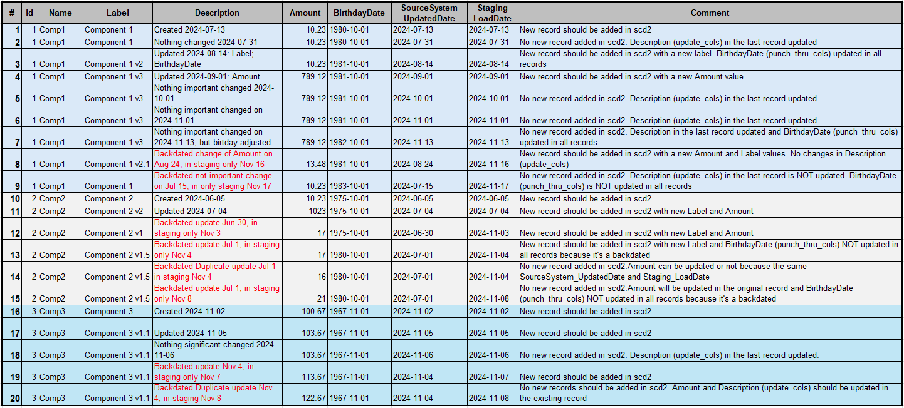
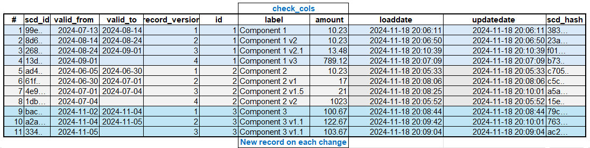
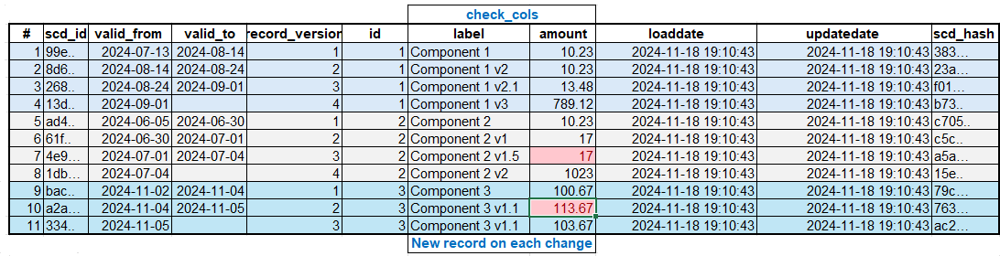

# Slowly Changing Dimension Type 2 (scd2) Custom Materialization dbt Package

## What does this dbt package do?

This DBT package provides a materialization that builds advanced version of slowly changing dimension type 2  (scd2):
- A new record is added if there is a change in **check_cols** column list like it's done in the original Check dbt snapshot strategy.
- It uses **updated_at** column like in the original Timestamp dbt snapshot strategy to define the time limits when a record is valid (valid_from - valid_to columns). 
- You can load data in a batch like one time, historical, initial load. The batch may contain several version of the same entity or even duplicates (the same **unique_key** and  **updated_at**). There is a deduplication embedded in the logic.
- If there is not a complete duplicate record (the same **unique_key** and  **updated_at** but different **check_cols** ), the logic can use **loaded_at** (data loaded in a staging area timestamp) to update **check_cols** with most recent known values.
- The dimension is loaded incrementally. It means, if an underlying table does not exist, it's created from the first data batch/row. Otherwise, new records are inserted and existing updated if needed.
- The load process supports ***backdated*** transactions. It means, if there is already an entity version in the dimension for a specific time period and later, you receive in your staging area, a new version of the same entity for the part of the existing time period (change in a past, already loaded data), the existing record in the dimension must be split in 2. See example below
- Along with Kimball Type II setting in **check_cols** , you can configure Kimbal Type I setting in **punch_thru_cols** column list. These attributes in **all** dimension record versions are updated.
- **update_cols** column lists are updated only in the **last** dimension record version.
- scd2_plus materialized dimension has these service columns:
  - Dimension primary key as a combination of **unique_key** and **updated_at**. It's **scd_id** by default, but can be configured in **scd_id_col_name** 
  - Dimension record version **start** timestamp is **valid_from** by default, but can be customized in**scd_valid_from_col_name** 
  - Dimension record version **end** timestamp is **valid_to** by default, but can be customized in  **scd_valid_to_col_name** 
  - Dimension record version **ordering number** is **record_version** by default and custom column name can be configured in **scd_record_version_col_name** 
  - Data loaded in a record at **LoadDate** timestamp, customizable in **scd_loaddate_col_name** 
  - Data updated in a record at **UpdateDate** , customizable in **scd_updatedate_col_name** 
- **LoadDate** and **UpdateDate** can be populated from **loaddate** provided, if you want to have the same timestamp in all your models or generated in the macros now() timestamp.
- The first entity record **valid_from** in the dimension can be eeh first **updated_at** (default) or any timestamp you provide in **scd_valid_from_min_date** . Setting **scd_valid_from_min_date** to **1900-01-01** allows to use the first entity record in a fact table transactions with transaction dates before the entity first **updated_at** value e.g. before the entity was born.
- The last entity record **valid_to** in the dimension is **NULL** by default, but you can override it with **scd_valid_to_max_date** . Setting **scd_valid_to_max_date** to something like **3000-01-01** will simplify joining fact records to the dimension avoiding **NULLs** in joins.
- There is also **scd2_plus_validation** test to check consistancy in **valid_from** and **valid_to** . It means no gaps in or intesection of versions periods in an entity. If not  default names are set in **scd_valid_from_col_name** , **scd_valid_to_col_name**, they should be specified in the test.

## How do I use the dbt package?

### Step 1: Prerequisites

To use this dbt package, you must have the following:

- A Snowflake, Redshift, PostgreSQL destination.
- Staging data with a **unique key** and **updated** columns

### Step 2: Install the package

Include  dbt_scd2_plus package  in your packages.yml file.

```
packages:
  - git: "https://github.com/KaterynaD/dbt_scd2_plus"
```

and run

```
dbt deps 
```

### Step 3: Configure model

**Minimum configuration** 

```
{{ config(
   materialized='scd2_plus',
   
   unique_key='id',

   check_cols=['label','amount'],
   updated_at='SourceSystem_UpdatedDate',
  
) }}

select 
id,
label,
amount,
SourceSystem_UpdatedDate
from {{ source('dwh','scd2_plus_staging_data') }}
order by id, SourceSystem_UpdatedDate

```

**Full customization** 

```
{{ config(
   materialized='scd2_plus',
   
   unique_key='id',

   check_cols=['label','amount'],
   punch_thru_cols=['name','birthdayDate'],
   update_cols=['description'],

   updated_at='SourceSystem_UpdatedDate',
   loaded_at='Staging_LoadDate',

   loaddate = var('loaddate'),

   scd_id_col_name = 'component_id',
   scd_valid_from_col_name='valid_from_dt',
   scd_valid_to_col_name='valid_to_dt',
   scd_record_version_col_name='version',
   scd_loaddate_col_name='loaded_at',
   scd_updatedate_col_name='updated_at',
   
   scd_valid_to_min_date='1900-01-01',
   scd_valid_to_max_date='3000-01-01'

   

) }}

select 
id,
name,
label,
amount,
birthdayDate,
description,
SourceSystem_UpdatedDate,
Staging_LoadDate
from {{ source('dwh','scd2_plus_staging_data') }}
where (Staging_LoadDate='{{  var('loaddate') }}' or '{{  var('loaddate') }}' = '1900-01-01')
order by id, SourceSystem_UpdatedDate, Staging_LoadDate

```
### Step 4: Add test

In a schema.yml

```
models:
  - name: dim_scd2_plus_full_config
    tests:
      - dbt_scd2_plus.scd2_plus_validation:
          unique_key: 'id'
          scd_valid_from_col_name: 'valid_from_dt'
          scd_valid_to_col_name:  'valid_to_dt'

```

### Step 5: Run dbt

```
dbt run
```
### Step 5: Run test

```
dbt test
```
## Data Transformation Example

**Staging Data**

Staging data consists from 3 entities and 4 types of columns:
- Service columns:
  - Source system ID is an unique identifier. it's a required column for scd2_plus - **unique_key**
  - Source System UpdatedDate reflects a date when the corresponding entity was created or updated in the source system. It's a required column for scd2_plus - **updated_at**
  - Staging LoadDate is the date when the record was added into Staging area. It's added to demo the backdated transactions issue and emulate incremental load in scd2. It's nice to have for scd2_load (**loaded_at**). The column is used in the de-duplication to prioritize the latest coming data with the same ID and UpdatedDate, but possible different meaningful columns. Without Staging LoadDate, the outcome is unpredictable in a case of duplicates. One, random, record will be selected.
  - Comment is a text to describe expected load into scd2
- The columns where a change means fixing an issue. No need to create a new record in scd2. they should be always the same in all versions of the same entity. They are candidates for **punch_thru_cols**
  - Name
  - BirthdayDate
- A descriptive column to describe something about the changes in an entity, not significant enough to create a new row. It's **update_cols**
- And the rest of the columns should create a new row in scd2 when theer is a change. They are **check_at**.
  - Label
  - Amount

Backdated transactions are highlighted in red. The records have more recent Source System UpdatedDate then already existed versions of the same entities. They may be added into Staging with a delay for whatever reason or, even, the update itself should have been happened earlier in Source System, byt did not. 



***Backdated transactions Insurance Industry example***: Your Auto policy due to renewal on Jan 15. An Insurance transaction system automatically creates a renewal transaction 2 months ahead, mid November (Futuredated transaction - issued in Nov 15, but effective Jan 15). You buy a new car on Dec 12 and add the new car to your Auto policy immediately. The system creates a new transaction for your current Auto policy (Normal transaction - issued on Dec 12 and effective Dec 12)  and a transaction for the renewal policy (Backdated transaction - issued in Dec 12, after the 1st one issued on Nov 15 and effective the same, Jan 15).

10 days later you notify the insurer, your teen son drives now your old car since Dec 12. The system creates a new transaction for your current Auto policy (Backdated transaction - issued on Dec 22 and effective Dec 12)  and a transaction for renewal policy (Backdated transaction - issued on Dec 22, after the 2nd one issued on Dec 12 and effective Jan 15). 

You start paying more for your old car coverage since Dec 12 because of the teen-driver starts driving the car on Dec 12, not Dec 22 when you notified your insurer.

Driver Birthday Date is an attribute of DIM_DRIVER scd2 and transactions reflecting increase in the premium should correspond to a proper risk attribute (Driver age) value. **Effective Date** is used as **update_cols**. It does not matter when the transaction was added in the system, only when the risk increased is important. Birthday Date is **check_cols** in this scenario, because if there is an error, not just the attribute should be fixed, but also a new transaction should be issued to adjust the premium.


**Fully customized scd2_plus dimension**

The data are the same (except loaded_at and updated_at) with one time (batch) and incremental load because  **loaded_at** is configured.


**Minimum configuration of scd2_plus dimension**

In a case when **loaded_at** is not added in the configuration, only incremental load produces the expected result.



One time (batch) load can not order duplicated records properly without **loaded_at**.
Wrong values highlighted in red.



