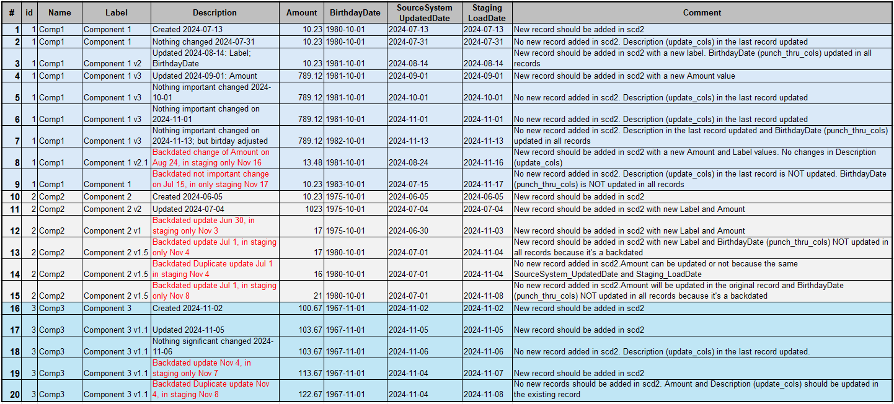
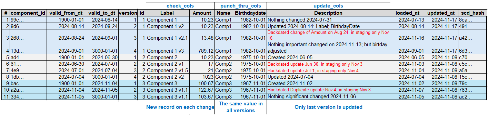
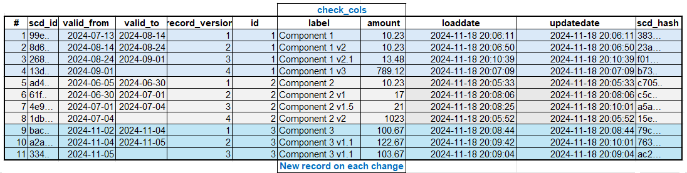

# This project is used for testing scd2_plus Slowly Changing Dimension Type 2 (scd2) Custom Materialization

To run the project add your specific **integration_tests** profile.

Staging data and etalon tests data are provided in **seeds** folder as csv files.

Before testing run

```
dbt seed
```

Staging data: **scd2_plus_staging_data.csv**



There are 4 use cases and corresponding test data in seeds:

- ## 1. Full Customization
    - ### One time (batch) load

    The logic creates a new table (**dim_scd2_plus_full_config_one_time_load**)and populates it with the data in one step.

    ```
    dbt run --select dim_scd2_plus_full_config_one_time_load
    ```
        
    Testing data are in **dim_scd2_plus_full_config_test_data.csv**

    To test run:

    ```
    dbt test --select dim_scd2_plus_full_config_one_time_load        
    ```
    

    - ### Incremental load

    The idea is to create a new table (**dim_scd2_plus_full_config_incremental_load**) from the first dbt run and subsequent dbt runs will insert new rows or update existing. There is **Staging_LoadDate** column in the staging data and it's used to emulate incremental load from the staging table with pre-existing data.

    There is a shell file with the set of dbt commands to load data for each **Staging_LoadDate** individually from the staging file.
    You may need to make the shell file executable first.

    ```
    chmod +x scd2_plus_full_config_incremental_load_test.sh
    ./sd2_plus_full_config_incremental_load_test.sh
    ```
    or run individual dbt commands from the shell file manually.

    To test run:

    ```
    dbt test --select dim_scd2_plus_full_config_incremental_load        
    ```
    The content of the dimension is identical to the one time (batch) load.

- ## 2. Minimum Configuration
    - ### One time (batch) load

    The logic creates a new table (**dim_scd2_plus_min_config_one_time_load**) and populates it with the data in one step.

    ```
    dbt run --select dim_scd2_plus_min_config_one_time_load
    ```
        
    Testing data are in **dim_scd2_plus_full_config_test_data.csv**

    To test run:

    ```
    dbt test --select dim_scd2_plus_min_config_test_data        
    ```
    **IMPORTANT!** This test most likely fail. It's expected output. There are duplicate rows (the same **unique_key** and **updated_at** but different **Amount**).
    Minimum configuration does not include **loaded_at** column (**Staging_LoadDate**) and the deduplication logic does not know what record should take precedence and use any record as the main one. 

    

    - ### Incremental load

    The idea is to create a new table (**dim_scd2_plus_min_config_incremental_load**) from the first dbt run and subsequent dbt runs will insert new rows or update existing. There is **Staging_LoadDate** column in the staging data and it's used to emulate incremental load from the staging table with pre-existing data, but it is not used in the scd2 dimension. Just in the staging SQL to select only specific records.

    There is a shell file with the set of dbt commands to load data for each **Staging_LoadDate** individually from the staging file. There is also a 15 sec delay between dbt runs to produce different timestamps in **LoadDate** and **UpdateDate** dimension columns.
    You may need to make the shell file executable first.

    ```
    chmod +x scd2_plus_min_config_incremental_load_test.sh
    ./scd2_plus_min_config_incremental_load_test.sh
    ```
    or run individual dbt commands from the shell file manually.

    To test run:

    ```
    dbt test --select dim_scd2_plus_min_config_incremental_load        
    ```        

    This test will pass because even without **Staging_LoadDate** in the loading logic, incremental load produces a proper order of the duplicated records.
	
    (Unless there are 2 duplicate records with the same **Staging_LoadDate**, but not in te provided staging data.)

    